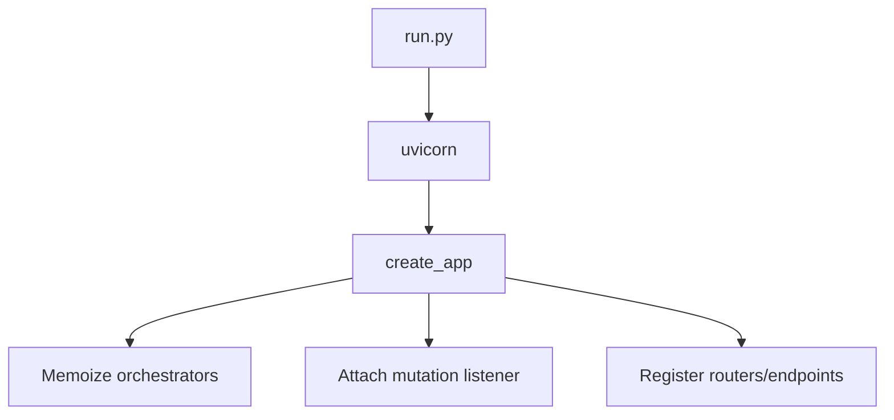

# Engine — Algorithm: High-Level Flow

```
STATUS: DRAFT
CREATED: 2024-12-17
```

---

## CHAIN

```
PATTERNS:    ./PATTERNS_Engine.md
BEHAVIORS:   ./BEHAVIORS_Engine.md
THIS:        ALGORITHM_Engine.md (you are here)
TEST:        ./TEST_Engine.md
SYNC:        ./SYNC_Engine.md
```

---

## Request Flow

1. **FastAPI entry (`engine/api/app.py`)**
   - Instantiates app via `create_app`
   - Configures orchestrator caches and SSE queues
2. **Graph Queries (`engine/db/graph_queries.py`)**
   - Provide typed methods (get_current_view, get_characters_at, etc.)
   - Compose Cypher strings and run via FalkorDB client
3. **Graph Operations (`engine/db/graph_ops.py`)**
   - Accept YAML/JSON mutation files or dict payloads
   - Emit mutation events to subscribed queues (SSE/debug)
4. **Orchestrator (`engine/orchestration/*`)**
   - Coordinates narrator, director, world runner steps
   - Delegates reads/writes to GraphOps/GraphQueries only
5. **Background Services**
   - `engine/actions` + `engine/scripts` supply CLI utilities for seeding/diagnosing

---

## Startup Sequence



---

## Data Guarantees

- Use MERGE for writes, MATCH for reads.
- Always include graph_name/host/port env overrides.
- SSE queues use `asyncio.Queue(maxsize=100)` to avoid leaks.
```
